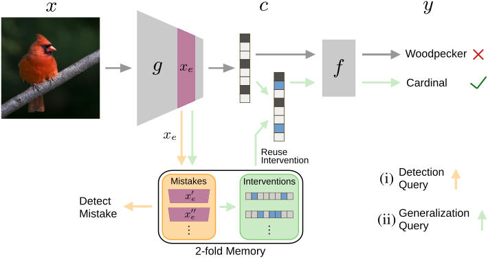

# ConceptBottleneckMemoryModels

This repository contains code for the Paper ["Learning to Intervene on Concept Bottlenecks"](https://arxiv.org/abs/2308.13453). It provides an implementation of concept bottleneck memory models (CB2M). CB2M are a flexible extension for any kind of concept bottleneck model (here presented exemplarily for CBMs by Koh et al. 2020). It enables detection of potential model mistakes (for human inspection and intervention). Furthermore, CB2M moves beyond one-time interventions by memorizing previous human feedback and automatically applying it again when applicable. 



## Installation:

* Install the `requirements.txt`
* The experiments on CUB are based on the paper "Concept Bottleneck Models" (Koh et al. 2020). To perform experiments on CUB, download the official CUB dataset (CUB_200_2011), pretrained inception v3 network (pretrained) and the processed CUB data (CUB_processed) from their codalab sheet (https://worksheets.codalab.org/worksheets/0x362911581fcd4e048ddfd84f47203fd2)

## Usage:

To perform the experiments desribed in the paper, the script `experiments.sh` is available. This exemplary contains commands to run all the experiments (for the fold 0). The general pipeline used for the experiments is the following:

* Training of the base CBM
* Precomputing data for the CB2M experiments
* Hyperparameter optimization
* Detection (and Performance): Evaluate the detection of mistakes and the performance of interventions after these mistakes
* Generalization: Evaluate the generalization of interventions to new data points.

Further details about run parameters can be found in `experiments.sh` and in the respective files.

## Citation

If this code is helpful to you, consider citing us.
```
@article{steinmann2023learning,
  title={Learning to intervene on concept bottlenecks},
  author={Steinmann, David and Stammer, Wolfgang and Friedrich, Felix and Kersting, Kristian},
  journal={arXiv preprint arXiv:2308.13453},
  year={2023}
}

